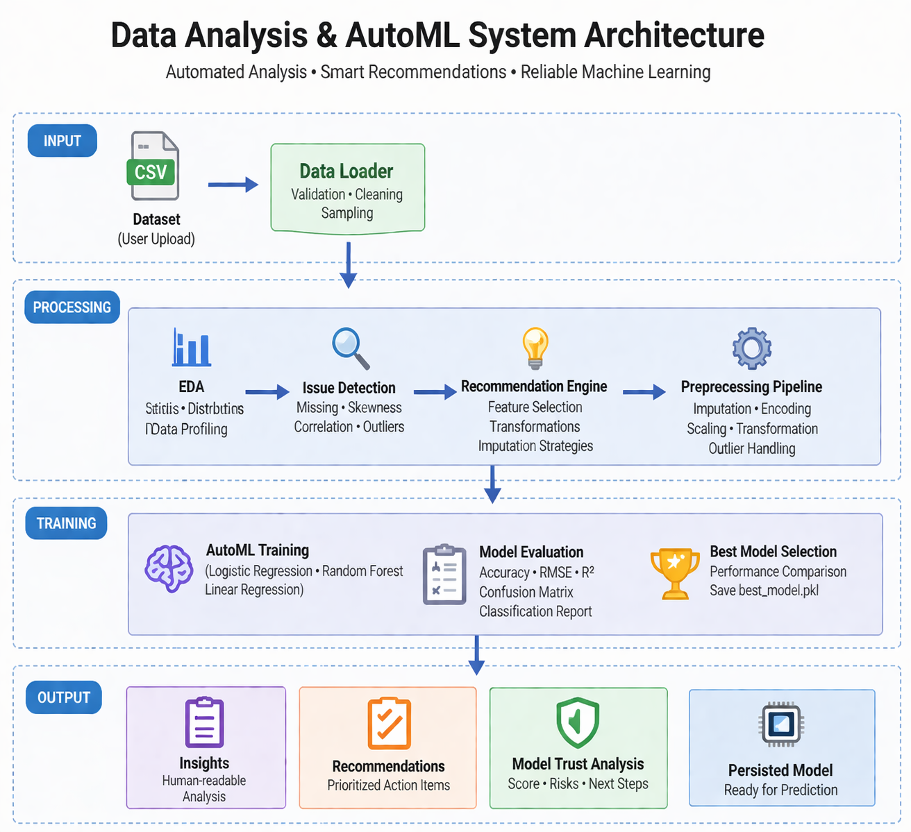

# Automated data analysis and AutoML system

> An intelligent system for automated data analysis, issue detection, and end-to-end machine learning pipeline generation.

## 📌 Overview

This project is a plug-and-play intelligent data analysis and AutoML system that automates the end-to-end machine learning workflow.

It reduces the need for manual effort by systematically analyzing datasets, identifying data quality issues, applying preprocessing techniques, and training multiple machine learning models to select the best-performing one.

Unlike traditional scripts, the system follows a structured workflow similar to how a data analyst approaches a problem:
```
Data → Analysis → Issue Detection → Recommendations → Preprocessing → Model Training → Evaluation → Model Selection
```
> The system is designed to work with real-world datasets, handling missing values, skewed features, and correlated variables while providing actionable recommendations and model performance insights.

---

## 🚀 Key Features

### 🔍 Data Understanding

- Automatic dataset preview (head, shape)
- Feature type detection (numerical & categorical)
- Missing value analysis with severity levels

---

### 🧠 Intelligent Analysis

- Skewness detection (distribution issues)
- Correlation analysis (multicollinearity detection)
- Data issue identification:
  - Missing values
  - Skewed features
  - Highly correlated features
- Structured, human-readable insights

---

### ⚡ Smart System Capabilities

- Plug-and-play support for any CSV dataset
- Automatic large dataset handling (sampling for performance)
- Flexible target selection (user-defined or auto-detected)
- Robust handling of real-world noisy data

---

### 🤖 AutoML Pipeline

- Automatic problem detection:
  - Classification
  - Regression

- Safe preprocessing pipeline:
  - Missing value imputation
  - Categorical encoding
  - Feature scaling
  - Skewness handling
  - Outlier handling

- Multi-model training:
  - Logistic Regression / Linear Regression
  - Random Forest

- Model evaluation:
  - Classification → Accuracy + Confusion Matrix + Classification Report
  - Regression → RMSE + R² Score

- Automatic best model selection  
- Model persistence (`best_model.pkl`)

---

### 💡 Recommendation Engine

- Identifies key data issues and prioritizes them
- Suggests:
  - Feature selection (for high correlation)
  - Transformations (for skewed data)
  - Missing value handling strategies
- Provides actionable next steps for model improvement

---

### 🔍 Model Trust & Validation

- Generates a model trust score (HIGH / MEDIUM / LOW)
- Detects:
  - Overfitting risks
  - Data quality issues
  - Small dataset limitations
- Provides reasoning behind trust level

---

## 🧠 What Makes It Unique?

This is not just an EDA or AutoML tool.

It is an intelligent system that mimics how a data analyst approaches a problem:

- Understands dataset structure
- Detects data quality issues
- Applies rule-based decision logic
- Recommends preprocessing steps
- Trains and evaluates models
- Provides model trust insights

Unlike traditional tools, it does not just execute steps —  
it **analyzes, decides, and guides the workflow**.

---

### 🔁 End-to-End Flow
Data → Analysis → Issue Detection → Recommendations (Advisory) → Preprocessing (Automated) → Model Training → Evaluation → Trust Analysis

---

##  System Architecture



> End-to-end workflow of the intelligent data analysis and AutoML system.

---

##  Project Structure

```
data-analysis-agent/
│
├── data/ # Input datasets
├── assets/
│   └── architecture.png
├── src/
│ ├── data_loader.py # Data loading & cleaning
│ ├── eda.py # Exploratory data analysis
│ ├── insights.py # Data issue detection & interpretation
│ ├── processor.py # Data preprocessing pipeline
│ ├── recommendation.py # Recommendation engine
│ ├── model_trainer.py # Model training & evaluation
│ ├── utils.py # Utility functions (trust score, helpers)
│ ├── agent.py # Main pipeline controller
│
├── app.py # CLI interface (entry point)
├── predict.py # Prediction on new data
├── best_model.pkl # Saved trained model
├── requirements.txt
└── README.md
```

---

## ⚙️ Tech Stack

* Python 
* Pandas
* NumPy
* Scikit-learn

---

##  How to Run

### 1. Clone the repository

```bash
git clone <your-repo-link>
cd data-analysis-agent
```

### 2. Create virtual environment

```bash
py -m venv venv
venv\Scripts\activate
```

### 3. Install dependencies

```bash
py -m pip install -r requirements.txt
```

### 4. Add dataset

Place your CSV file inside the `data/` folder.

---

### 5. Run the application

```bash
py app.py
```

---

## 📊 Output

After execution, the system will:

- Analyze the dataset automatically
- Detect data quality issues (missing values, skewness, correlation)
- Generate prioritized recommendations
- Apply preprocessing (imputation, encoding, scaling, transformations)
- Train multiple machine learning models
- Evaluate models using appropriate metrics:
  - Classification → Accuracy, Confusion Matrix, Classification Report
  - Regression → RMSE, R² Score
- Select the best-performing model
- Save the trained model (`best_model.pkl`)
- Provide model trust analysis and improvement suggestions

---


## 💡 Example Use Cases

- Rapid dataset understanding for new machine learning projects  
- Automated detection of data quality issues (missing values, skewness, correlation)  
- Data preprocessing guidance for cleaner and more reliable models  
- Quick baseline model training and comparison  
- Assisting beginners in understanding end-to-end ML workflows  
- Supporting analysts in generating actionable insights from raw data  

---

## 🧠 Future Enhancements

- Interactive dashboard using Streamlit for better visualization and usability  
- LLM-assisted querying for natural language interaction with datasets  
- Feature importance and model explainability (SHAP / permutation importance)  
- API deployment for real-time predictions  
- Automated data validation and leakage detection improvements  

---

## 📌 Resume Highlight

> Built an intelligent data analysis and AutoML system that automates exploratory data analysis, detects data quality issues, generates actionable recommendations, and implements a leakage-safe machine learning pipeline to train, evaluate, and select the best-performing model.

---

## 🚀 Final Thought

This project streamlines the journey from raw data to decision-ready insights:
```
Data → Analysis → Issue Detection → Preprocessing → Modeling → Evaluation → Insight Generation
```

> It demonstrates how structured automation and data-driven decision logic can significantly reduce manual effort in building reliable machine learning workflows.